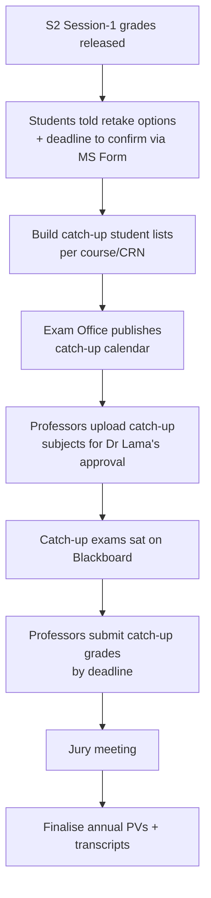

# Catch-up (resit) exams

The **rattrapage** — the Session 2 sitting for courses a student did not validate.
This is one of the busiest and most correspondence-heavy periods of the year
(typically **late June**).

## The rules that drive every student answer

Memorise these; they answer ~90% of student emails:

!!! abstract "Retake policy"
    1. If your **overall yearly average is ≥ 50/100**, you are **not required** to
       retake any course you didn't validate.
    2. You **may** still choose to retake any course you did not validate (grade
       below 50/100) to improve it.
    3. A **validated** course (≥ 50/100) **cannot** be retaken, regardless of your
       yearly average.

!!! abstract "The 'max' rule — final grade after catch-up"
    The final grade for a retaken course is the **maximum of three values** (per
    Dr Lama Tarsissi's guidance):

    ```
    final grade = max( weighted grade with catch-up,   ← recomputed
                       previous grade,                  ← already on transcript
                       new catch-up grade )             ← the resit mark
    ```

    - **Weighted grade with catch-up** — the grade recomputed from the continuous
      assessment (e.g. midterms) **combined with** the catch-up mark.
    - **Previous grade** — the grade already on the student's transcript
      (first session).
    - **New catch-up grade** — the raw mark obtained in the catch-up exam.

    In practice the catch-up therefore **can only help, never hurt**: if none of the
    recomputed options beats the previous grade, the original grade and result
    stand. Consequently the **"Second Session" / "Catch-up" mention appears on the
    transcript only when the result was raised.** A student seeing "no change"
    usually means none of the three options beat their previous grade — direct them
    to their professor for the mark itself.

!!! warning "Open question — variation by level/programme"
    How the max rule (and the pass/fail averaging around it) is applied **may differ
    across FYS vs L1/L2/L3**, and the exact per-level calculation was flagged as an
    open item in the working notes rather than confirmed. The formula above is the
    one stated for the Foundation courses; **confirm the per-level details with the
    relevant HoD** (Dr Lama for FYS, Dr Omar for Maths, Dr Valérie for Physics)
    before relying on it for a Bachelor cohort. Related: averaging and who
    passes/fails is itself **different for FYS and L1/L2/L3**.

!!! abstract "Purpose"
    Catch-up exams exist to let students **improve** their grades. Even a student
    who has validated both semesters (by compensation or otherwise) may sit
    catch-ups in the courses they didn't pass, to improve.

For FYS, note there is **no refus de compensation** — the retake logic is simpler.

## Registration & eligibility

- Students are **registered by default** in all their failed courses for
  catch-up.
- If a student's transcript shows they **validated the Fundamental Block**, they
  do **not** need to sit the catch-ups → remove them from those exams.
- Courses a student is **required** to repeat are marked with an **asterisk (`*`)**
  on the transcript.
- Students confirm their retake choices via a **Microsoft Form**, by a stated
  deadline (typically a few days after grades are released).
- Removals: when a professor/HoD confirms a student validated a course, remove
  that student from the corresponding catch-up exam and inform the professors.

## The catch-up cycle



## Coordinator responsibilities during catch-up

- **Publish/relay the calendar** (Exam Office produces it; you relay to
  students/professors).
- **Maintain the student lists** — add/remove based on validation status. When
  working in the shared workbook, use **private filters** only; applying a filter
  for everyone causes confusion for other users.
- **Chase professors** to (a) upload catch-up subjects for **Dr Lama's approval**
  and (b) submit catch-up grades by the deadline (grades are needed **before** the
  jury meeting).
- **Ask professors to record attendance** in the designated column: *attended* vs
  *attended but submitted no work*. This is required to process records accurately.

## Hard lines to hold with students

- **No individual retakes** outside the official catch-up period — not for
  connectivity problems, missed exams, or personal circumstances. All students
  follow the same schedule and regulations.
- A **zero for a non-submission** (e.g. exam link not opened, work not uploaded to
  Blackboard) is a submission/process issue, distinct from a graded low mark —
  but it is still not grounds for an out-of-session retake.
- Grade-content disputes (was my paper marked correctly?) go to the **professor**,
  not the coordinator — you don't have visibility into grading correctness.

## Attendance list caveat (Blackboard)

While **anonymous grading** is active on a Blackboard exam, you can only see the
**number** of submissions, not **who** submitted. Wait until grading is complete
and anonymity is lifted before generating a definitive submitter/attendance list —
otherwise the data is inaccurate.

## Timing

- Catch-up session: roughly **22–29 June** (varies by year).
- Catch-up grades due from professors: shortly after, ahead of the **jury**
  (early July).
- Updated official transcripts/annual results: typically **mid-July**, published
  by Admissions once received from Paris (for Bachelor).
