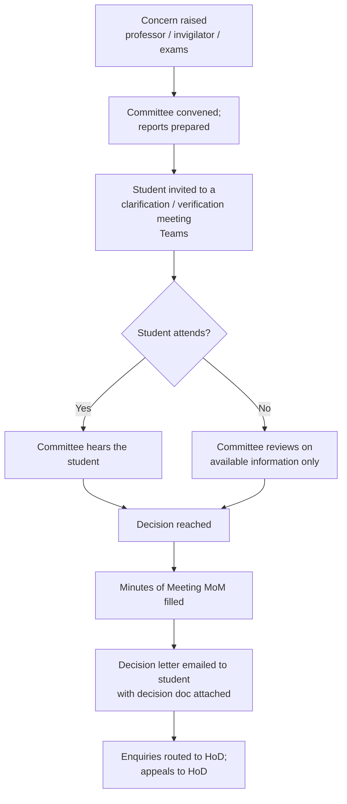

# Disciplinary Committee (DC)

The process for academic-integrity cases (suspected exam misconduct). The
coordinator handles the **logistics** — scheduling, minutes, decision letters —
not the academic judgement.

!!! note "Confidentiality"
    DC cases involve named students and sensitive findings. This page documents the
    **process only**. Actual case files live in the shared **"SCEN-Disciplinary
    committees"** folder; keep case details out of general documentation and
    correspondence.

## What triggers a DC

Typical triggers, raised by a professor, invigilator, or the Exams/Registrar
office:

- Suspected discrepancy in submitted work (e.g. handwriting inconsistent with the
  student's known work, answers not matching ability shown elsewhere),
- Exam-environment / proctoring issues (camera positioning, second-camera missing,
  environment video missing),
- Other irregularities in an online exam.

Until the Committee reaches a decision, the student's submission is **graded under
the same conditions as everyone else** — no pre-emptive penalty.

## The people

The committee typically involves:

- The **Head of Department / Programme** for the subject (Dr Valérie — Physics;
  Dr Omar — Maths; Dr Lama — FYS),
- **Registrar / Exams** (e.g. Sara Zaki — provides the DC MoM template),
- **Admissions** (Fady Khoury) for student-communication sign-off,
- The **coordinator**, who runs the logistics.

Enquiries after a decision are routed: **Dr Omar** for Maths students, **Dr Valérie**
for Physics students. **Appeals** go to the HoD (Dr Valérie).

## The process

### Step detail

1. **Convene & prepare** — the concern is documented and reports are prepared;
   the committee is scheduled. Registrar provides the **DC MoM template**.
2. **Invite the student** to a **clarification/verification meeting** (Teams).
   Send the invitation with the correct time — **state the timezone explicitly**
   (Abu Dhabi time) to avoid confusion, and allow reasonable notice.
3. **Hold the meeting.** If the student **does not attend** and no prior
   clarification took place, the committee proceeds on the **available information
   only**.
4. **Fill the MoM** — use the **DC MoM filler tool** (`4_MoM/` in the working
   directory) rather than hand-editing the template. It fills the tokenised
   template from a JSON of meeting fields (date, time, student, attendees,
   violation, warnings, minutes, decision) and validates the output before saving.
5. **Send the decision** — email the student the outcome with the decision
   document attached ("please read it carefully; it sets out the Committee's
   findings and the decision reached"), and include the enquiries-routing line
   (Dr Omar / Dr Valérie). Get Admissions/HoD sign-off before sending
   communications where required.

## Handling appeals

A student may write to the HoD (Dr Valérie) contesting the decision or the
process (notice period, access to evidence, reliability of the basis). Treat these
as HoD/Committee matters — the coordinator forwards and schedules, and does not
adjudicate.

## The MoM filler tool (reference)

The `4_MoM/_tool/` toolset:

- Fills `DC MOM (template).docx` from a JSON of field values, one MoM per student.
- **Validates before saving** (no leftover tokens, well-formed XML, valid docx) —
  it aborts rather than write a broken file.
- Can render a **PDF** for a quick visual check.
- A local **transcript viewer** (`view-transcripts.command`) serves cleaned
  meeting transcripts for search.

Meeting transcripts are dropped per student into `4_MoM/meetings/<Student>/`, and
the filled MoM is written into the same folder. See the tool's own README for the
exact commands and JSON schema.
