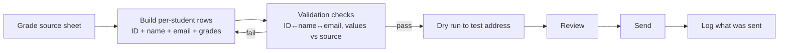

# Communicating grades to students

At the end of each session you send each student their **grade breakdown** and
their **retake options**. Because this is high-volume and personalised, it is
usually done with a mail-merge / automation pipeline driven by a spreadsheet — and
that is exactly where mistakes happen.

## What the grade email contains

A standard grade communication includes:

- The **per-course grades** for Semester 2 (course, code, grade `/100`),
- The **overall S1**, **overall S2**, and **yearly (L1)** grades — both `/100` and
  `/20`,
- A note that results are **pending definitive official validation by the Grade
  Validation Committee in Paris** (for Bachelor),
- The **retake policy** (the three rules — see [Catch-up exams](catch-up-exams.md)),
- The **specific courses** the student may retake,
- A **deadline** to confirm retake choices via the linked form(s),
- A routing line: *"For any enquiries, contact **Dr Omar ElDakkak** for
  Mathematics students, and **Dr Valérie Le Guyon** for Physics students."*

There are effectively a few **templates**: "no courses to retake / congratulations
on moving to L2", "courses to retake", and correction messages.

## The failure mode to design against

!!! danger "Wrong-student data is the catastrophic error"
    A single spreadsheet oversight once caused **11 Physics students to receive
    another student's grades** in an automated send. The fix was a correction email
    to each affected student — but the real lesson is **build checks before you
    send**.

    Before any automated grade send, verify:

    - Each row's **student ID ↔ name ↔ email** are internally consistent (the
      email must match the student the grades belong to).
    - The grade values reconcile against the **source grade sheet** (not a stale
      copy).
    - A **dry run** to yourself / a test address, reviewed, before the real send.
    - Ideally, cross-check against an independent record (e.g. the official student
      roster) so a mismatched ID is caught automatically.

## Recommended flow

## Practical notes

- Keep the **source spreadsheet** authoritative and regenerate the send data from
  it each time; never hand-edit merged rows.
- If you discover an error **after** sending, send a clearly-marked correction to
  **each affected student** ("please disregard the previous email; this is the
  official communication"), and add the missing check to the pipeline.
- For grade-content questions you can't verify, direct students to the **professor**
  (and for FYS transcript queries, professors are the ones who confirm any grading
  error — coordinators don't have visibility into grading correctness).

## The bulk-communication gap

There is currently **no clean way to email a defined student population** (all L1,
all L1 Maths, etc.) — it means manual recipient selection. Two options are under
discussion with IT (Khader):

1. **Distribution lists** for predefined student groups (question: how to maintain
   membership over time), or
2. **Banner-based groups / parent CRNs** for populations like "L1 Students", so
   students can be reached through Banner communications with membership managed
   from Banner data.

See [Known issues & backlog](../reference/known-issues.md).
