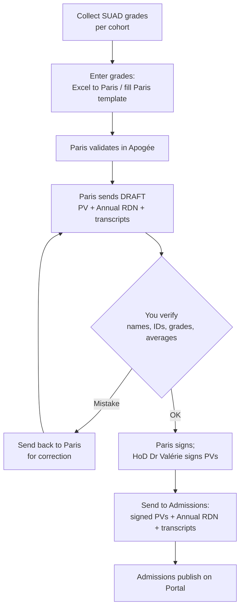

# Bachelor (L1–L3) grade workflow

The Bachelor workflow is the FYS workflow **plus Sorbonne Paris**. Paris validates
the grades and issues the official PVs and transcripts; your job is to feed Paris
the right grades, verify what comes back, route signatures, and deliver to
Admissions.

!!! warning "Partnership in transition"
    This describes the **Université Paris Cité** workflow. With the transition to
    **Paris-Panthéon-Assas (Paris II)**, expect the Paris contacts and routing to
    change for future cohorts. Verify before applying to a new year.

## Grade entry — who sends what to Paris

| Cohort | Mechanism |
|---|---|
| **L1** (Maths & Physics) | Fill the **Paris-provided Excel template**. |
| **L2 / L3 Mathematics** | Send our **own Excel** to Paris (Annick). |
| **L2 / L3 Physics** | Fill the **Paris-provided Excel template** (Steve). |

The **SUAD → Sorbonne grade-transfer tool** automates filling the Paris L1 upload
sheet from the SUAD grading sheets (with a strict verification suite; grades
written at full precision). See the working directory.

## End-to-end flow

## The Paris counterparts

| Person (Paris Cité) | Responsibility |
|---|---|
| **Steve** | L2 / L3 Physics |
| **Annick** | L2 / L3 Maths |
| **Sophie Neveu** | Lead, L1 Maths/Physics |
| **Solène** | L1 grades |
| **Jessica** | L1 maquette / barème |

## What to attach when sending to Admissions

1. **Annual RDN signed by Paris** (verify the draft first, then have Paris sign;
   it does *not* also need the HoD signature).
2. **PVs signed by Paris *and* the HoD** (Dr Valérie).
3. The **transcripts** (usually via the shared link/folder Admissions can access).

## Ordering & timing notes

- Bachelor annual results often lag FYS. L3 in particular can be delayed by
  **internship assessments** — communicate expected windows to Admissions and
  students rather than promising a date you don't control.
- You are frequently the buffer between students/Admissions asking "where are my
  grades?" and Paris, who hold the signed PVs/transcripts. The honest line: results
  are published by Admissions **once officially received from Paris**; transcripts
  are typically **not available before mid-July**.

## Corrections from Paris

If a computed average or a per-student value looks wrong on a Paris PV, flag it
back to the responsible Paris counterpart with the specific student ID and the
value you expect, and ask for the corrected PV/RDN. Corrections mid-process are
routine — see [Grade corrections](grade-corrections.md).

!!! tip "Verify before you forward — every time"
    The most common failure mode is forwarding a Paris document with an
    undetected error. Cross-check against your own grade sheets and the
    reconciliation tools before anything goes to signature or Admissions.
