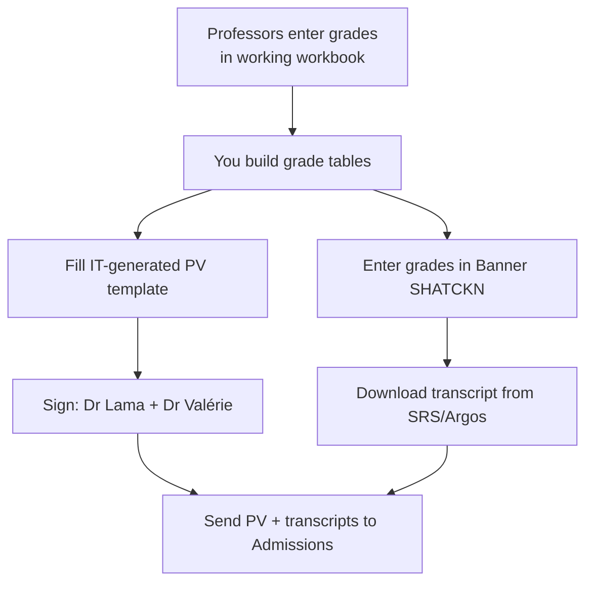

# FYS grade workflow

Foundation Year in Sciences grades are handled **entirely locally** — no Paris in
the loop. This is the workflow you own end to end.

!!! info "FYS-specific facts"
    - `SHATCKN` in Banner is **FYS only** — it's how FYS grades are entered/changed.
    - **SRS/Argos** is where you download FYS transcripts.
    - In S1, the Maths and Physics FYS tracks are the **same**; students may switch
      track after S1.
    - There is **no refus de compensation** concept for FYS.

## Standard workflow

1. **Create the grade tables** for the cohort (the working grade workbook the
   professors fill).
2. **Get the PV template** — IT generates the PV template (historically the
   templates were prepared by IT; you can clone them). Contact Junaid for the
   template of how the FYS PV comes out of SRS.
3. **Fill the PV** with the grades and send it for **signature**:
      - **Dr Lama Tarsissi** (Head of Programme, FYS), and
      - **Dr Valérie Le Guyon** (HoD).
4. **Enter grades in Banner** via `SHATCKN` (choose the correct semester —
   the change could be in S1, S2, or both).
5. **Download the transcript** from **SRS/Argos**:
   *Registrar Office → "2026 Student Academic Report (Final Grade) — Sciences and
   Engineering with Jury decision"*.
6. **Send to Admissions** the signed **PV + transcripts**.

## Grade tables → PV → Banner → transcript

## Annual PVs & transcripts

At year end you produce the **annual** FYS PVs (Maths and Physics) plus the
annual transcripts, after the catch-up session and jury. These go to Admissions
together (PVs attached, transcripts via the shared link/folder).

## Jury decision on the transcript

FYS transcripts carry a **jury decision** — e.g. *Pass to L1*, *Foundation year to
be repeated*, or *Failed the year*. To validate the year a student must validate
**both fundamental blocks (S1 and S2)** and meet the overall final-grade
threshold. The jury adjudicates borderline / repeat-vs-fail-out cases.

!!! warning "Keep every sheet in sync"
    A single FYS grade lives in several places: the working workbook, the PV
    (before-catch-up and after-catch-up versions), any carry-over sheets, Banner,
    and the transcript. When a grade changes, it must be reflected in **all** of
    them. See [Grade corrections](grade-corrections.md) for the disciplined way to
    do this.

## Tooling note

The **DC MoM filler** and the **grade-consolidation** verifier both live in the
working directory and touch FYS artefacts. The consolidation tool reconciles the
FYS transcripts against the jury Excel files to prove they agree — run it before
finalising if you want a safety net.
