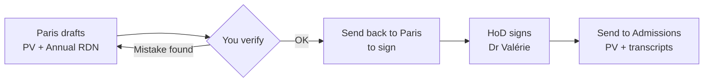

# Grades, PVs & transcripts

The single most important area of the role. Read this page before the
programme-specific workflows.

## PV vs transcript

| | **PV** (procès-verbal) | **Transcript** (relevé de notes / RDN) |
|---|---|---|
| Contains | **All** students' grades for a programme/semester | **One** student's grades |
| Audience | Official record, signed & archived | The individual student |
| Who issues (FYS) | IT generates the template; you fill it | Downloaded from **SRS/Argos** |
| Who issues (L1–L3) | **Sorbonne Paris** | **Sorbonne Paris** |

A **PV must be signed before *and* after the catch-up session** — there is a
"before catch-up" version and an "after catch-up" version, and the HoD
(Dr Valérie for Physics) signs **both**.

## The order of exam sessions & reporting

Grades are reported in this sequence across the year:

1. **S1, Session 1** — grades are collected and PVs signed during Semester 1.
2. **S2, Session 1** — the first sitting of Semester 2 exams.
3. **S1 / S2, Session 2** — the **catch-up (resit)** session covering both
   semesters.
4. Grades for **(2) and (3) are finalised and PVs signed at the end of S2.**

So most of the second half of the year is: collect S2 grades → communicate to
students → run catch-up → jury → finalise annual PVs and transcripts.

## Who enters grades where

The grade-entry mechanism differs by programme and subject:

| Cohort | How grades are entered |
|---|---|
| **FYS** | Entered locally in **Banner** via `SHATCKN`. |
| **L2 / L3 Mathematics** | We send an **Excel** to Paris (Annick). |
| **L1, and L2 / L3 Physics** | We fill the **Paris-provided Excel template**. |

For all Bachelor cohorts, **Paris** then produces the official PV and transcripts.

## The signature & delivery chain (Bachelor)

When a Bachelor PV/transcript is ready to go to Admissions, the chain is:

When sending to Admissions, attach:

1. **Annual RDN signed by Paris** — note: this does *not* additionally need the
   HoD's signature. When Paris first sends it, it is a **draft**: verify it, then
   send it back to them to sign.
2. **PVs signed by Paris *and* the HoD** (Dr Valérie).

!!! tip "Always verify Paris documents before forwarding"
    Paris PVs/transcripts do contain occasional mistakes (wrong averages, missing
    students). Cross-check names, IDs, per-course grades, and computed averages
    against your own records **before** the document goes to signature or
    Admissions. Sending a request back for correction is normal.

## FYS vs Bachelor at a glance

=== "FYS"

    - You create the grade tables.
    - **IT generates the PV template**; you fill it and send for signature.
    - Grades go into **Banner via `SHATCKN`**.
    - Transcript comes from **SRS/Argos**.
    - PV signed by **HoP (Dr Lama)** and **HoD (Dr Valérie)**.
    - Send to Admissions with the transcripts.

    → Full steps: **[FYS grade workflow](grades-fys.md)**

=== "Bachelor (L1–L3)"

    - Same shape as FYS **plus Paris in the loop**.
    - **Paris** sends the PV and transcripts (not IT).
    - Grade entry per the table above (Excel to Paris, or fill Paris template).
    - Signature chain as above.

    → Full steps: **[Bachelor grade workflow](grades-bachelor.md)**

## Related tooling

Two internal tools support grade work (see the working directory, not this site):

- **SUAD → Sorbonne grade transfer** — fills the Paris upload sheet from the SUAD
  grading sheets, with a strict verification suite. Write grades at **full
  precision** (no rounding).
- **Transcript ⇄ jury consolidation** — a verify-only reconciliation that proves
  the PDF transcripts and the jury Excel files agree, flagging any real
  discrepancy.

Both encode important invariants (e.g. a grade should only change after catch-up
if the student *refused compensation* for that course). If you maintain them,
keep their self-tests passing.
