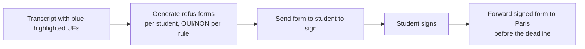

# Refus de compensation

A **refus de compensation** is a student's formal decision to **refuse the
compensation** of a semester — i.e. they'd rather sit the resit than pass a
semester on the aggregate. The signed forms are routed to Paris.

!!! info "Key facts"
    - Applies to **Bachelor (L1–L3)** — there is **no refus de compensation for
      FYS**.
    - The forms exist **per level** (L2, L3) and per semester block (S3/S4 for L2,
      S5/S6 for L3).
    - The signed forms must reach **Paris** in a timely manner, respecting the
      deadline.

## What compensation is

Compensation lets a student **pass a semester on the overall average** even if an
individual course (UE) is below the pass mark. Refusing compensation means the
student wants that course result to stand / to be resat rather than absorbed into
a compensated pass.

## The locked OUI/NON rule

These are the rules used to fill the forms (source: the refus-compensation rules
used by the form generator):

**Per-semester choice**

- **OUI** — the student refuses compensation for that semester.
- **NON** — the student does not refuse compensation for that semester.
- A semester is **OUI** when **at least one UE (course) of that semester is
  highlighted in blue** on the relevé de notes. **Only blue-highlighted cells
  count.**

**Annual choice**

- If **S3 = NON and S4 = NON** → **ANNUAL = NON**.
- If **at least one semester is OUI and the year is validated** → **ANNUAL = OUI**.
- If the **year is not validated** → **ANNUAL = NON**.

The same logic applies to **S5 and S6** at L3 level.

## The process

1. **Determine OUI/NON** per the rule above from each student's transcript
   (blue-highlighted UEs).
2. **Generate the forms** — the **refus-de-compensation tool** (`7_refus-de-
   compensation/` in the working directory) fills the `Formulaire refus de
   compensation` docx per student from the student list + the highlight rule.
3. **Send each student their form to sign**, asking them to return it promptly so
   it can be forwarded to Paris **in a timely manner**.
4. **Forward the signed forms to Paris** before the deadline.

!!! tip "Some students submit directly to Paris"
    In some cases students are asked to send the form **directly to Paris** (to the
    address named on the form), respecting the deadline, without routing through
    the coordinator. Check the current instruction for the cohort.

## Relationship to grades & catch-up

The refus record is also a **cross-check on grade changes**: a course grade should
only change after catch-up if the student **refused compensation** for that course
(the *L1 Refus de Compensation* archive workbook is the source of truth, matched
by Apogée ID, expecting **OUI**). See [Grade corrections](grade-corrections.md).

## Tooling note

The generator (`7_refus-de-compensation/`) reads the student list + transcript
highlights and produces one filled form per student. The **rules file**
(`refus-compensation-rules.md`) encodes the OUI/NON logic above and is the
authority if the code and this page ever disagree.
