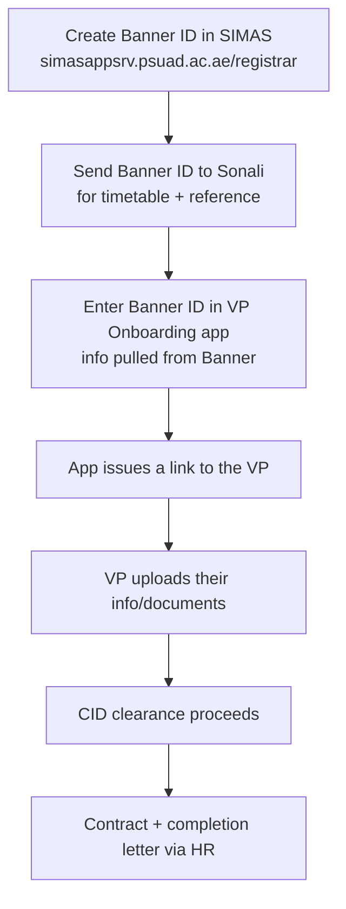

# Staffing & contracts

How teaching staff get hired, cleared, contracted, and paid — and which parts are
the coordinator's job. The dividing line: **full-timers are HR's; part-timers and
visiting professors are largely yours.**

!!! abstract "Who owns whom"
    - **Full-time (FT):** HR handles hiring/data-entry. You only **enter them in
      the timetable** and **assign them to courses** on Portal. **Not** your
      jurisdiction for requisitions.
    - **Part-time (PT):** you handle requisitions, CID (if new), and timesheets.
    - **Visiting Professor (VP) / PROA:** you create the Banner ID and run
      onboarding.

## Full-time (FT)

- Taken care of by **HR**.
- Your only actions: enter them in the **timetable**, and **assign them to their
  courses** on **Portal** (*Faculty Services → Monitoring Courses → select the
  semester → assign with `+`*).

## Part-time (PT)

### If the teacher is NEW → CID clearance first

New part-timers need **CID clearance**, processed with **Mona Mohamed** (HR).
Collect the document pack from the teacher:

- [ ] CV
- [ ] Latest degree / grade
- [ ] Passport copy
- [ ] Passport photo
- [ ] Emirates ID
- [ ] Pre-employment form (HR provides it)
- [ ] Bank details (HR provides the form)
- [ ] No-objection certificate (NOC)

Send the collected pack to **Mona** (`mona.mohamed@sorbonne.ae`) to start CID
clearance. **Once CID is approved**, fill the **Teaching Recruitment
Authorization** (requisition) form → **Dr Valérie (HoD)** signs → send to HR
(**Mona** for new joiners) to prepare the contract. On receipt of the signed
requisition (HoD **and** DVC), HR Operations (**Dimah**) prepares the contract and
completes onboarding.

### If the teacher is NOT new

- **Requisition form → Dr Valérie signs → send to Dimah** (HR Operations), **CC
  Khaled**. (Not Mona — Mona is for new joiners / CID.)

## Requisition forms

The requisition (Teaching Recruitment Authorization) form is a `.docx` filled per
person.

- **Lifecycle:** you create the form → send to **Dimah (HR)**.
- **Separate admin from academic:** anything admin-related goes on a **separate**
  form so admin and academic hours aren't mixed.
- **Job title:** use **"Part Time Lecturer"** for everyone (the dropdown has no
  full-time option — even full-timers use this; explicit convention).
- **Department:** *Department of Sciences and Engineering* for SCEN.
- **Employee ID / net pay:** leave **blank** — HR fills these.
- **Amendments:** if a requisition already written needs changing, **replace the
  old one with a new one**.
- **Budgeting horizon:** hours can only be budgeted **until the contract end date**
  (e.g. 31 Dec 2026). Activities after that (invigilation, marking, meetings) are
  charged to the next budget period.
- **Rates:** e.g. Teaching Assistant contracts at **AED 150/hr**, rising to **AED
  350/hr** on proof of a master's degree (then a new requisition is issued).

!!! tip "Admin hours ≠ course hours"
    Some requisitions are for **admin (paid) hours**, a different accounting from
    the **course hours** in the teaching-load workbook — they intentionally won't
    match, and there's no admin-hours column in the workbook to validate against.
    Take the admin numbers as given.

### The requisition generator (reference)

`6_requisition-forms/` in the working directory holds a generator that fills the
template by stable anchor IDs (it edits the underlying docx XML because
python-docx can't set content-control values). Two generators exist —
`gen_lang_forms.py` (language teachers) and the admin-requisition flow — plus a
detailed **HANDOFF-Codex.md** documenting the template anchor map, conventions,
and program-dropdown values. Consult that handoff before regenerating forms.

## Visiting Professors (VP) & PROA

**PROA** = Professional on Assignment. **Local PROA** has no PhD; **Flying PROA**
comes from abroad. VPs and PROA are created via **SIMAS**.

Process for a new VP / Local-PROA:

- After creating the Banner ID, **send it to Sonali** so the VP can be added to
  the TT and as a reference.
- The **VP Onboarding app** pulls scheduling info from Banner once you enter the
  Banner ID; submitting it **auto-issues a link** the VP uses to add their
  info/documents, feeding CID clearance.
- **VP contracts & completion letters** are chased by HR (Mona) — keep them moving.
- **VP travel (flights/hotels)** is done via **PRs** with Procurement, using GL
  combinations from Finance — but note PR-raising for VP travel has been subject to
  holds; confirm current guidance before raising.

!!! note "The local-PROA workaround"
    When CID clearance for a part-timer keeps getting declined, one workaround has
    been to enter them via **VP Onboarding as a Local PROA** to be able to pay
    them. This is cumbersome (per-CRN payment approvals) — the cleaner route, where
    possible, is a normal HR contract (treated as a new joiner if they never got
    CID).

## Teaching hours & payment

- **FT extra teaching hours** are paid **in July for the whole year**. HR keeps
  the record; SCEN keeps its own in the teacher-hours sheet — **cross-check** the
  HR breakdown against yours, and if in doubt contact the professor (CC HR).
- **PT timesheets:** part-timers submit timesheets on the **mandatory new
  template** for salary processing, per HR (Enas). The submission window runs
  mid-month to mid-month (e.g. 15 Jun–14 Jul). You collect signed timesheets and
  forward to HR.
- Everything about part-time teaching hours also exists in **Portal**.

## Requisition status (26-27 snapshot)

Requisitions have been done for **Languages** and **part-timers** (both apply to
all levels). Still outstanding are people with **admin work** and anyone not yet
provided info. Full-timers are **out of scope** for coordinators. See the
`HANDOFF-Codex.md` for the live status of individual forms.
