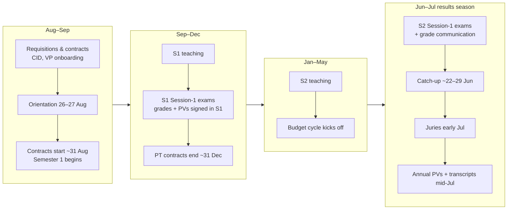

# Annual cycle

A rough calendar of the SCEN coordinator year, so you know what season you're in
and what's coming. Dates are indicative (based on 2025–26 / 26–27) and shift
year to year — always confirm against the official academic calendar.

!!! note
    This handbook was assembled mid-year, so the **May–July "results season"** is
    the best-documented stretch. The earlier months are sketched from the recurring
    shape of the year; refine them as you live through a full cycle.

## Year at a glance

## Term codes

Banner term codes follow `YYYYTT`-style numbering, e.g. `252620` = AY 25-26,
Semester 2; `262720` = AY 26-27, Semester 2. Courses roll from one to the next
(see [Courses & CRNs](../procedures/courses-crns.md)).

## By period

### August – September (start of year)

- Finalise **requisitions** and **contracts** for part-timers/VPs; complete **CID**
  clearances and **VP onboarding**.
- **Orientation** for new students (26–27 August in 26-27; placement tests happen
  **before** orientation). HoDs deliver a welcome; departments meet their new L1
  and Foundation students.
- **Contracts start** ~31 August; **Semester 1** begins.
- Set up **timetables** for the new year (with Serco/Sonali), including new
  programmes (MIAI).
- Create/roll **courses & CRNs** in Banner for the new maquette.

### September – December (Semester 1)

- S1 teaching; **S1 Session-1 exams**; **grades collected and S1 PVs signed within
  S1**.
- **Part-time contracts end ~31 December** — budget teaching hours only up to the
  contract end date.
- **Education Allowance** window (via ADERP) is roughly **July–October**.

### January – May (Semester 2)

- S2 teaching.
- **Budget cycle** kicks off (department assessment needs, recruitment
  questionnaire, masters-programme budgets). Do the budget with the relevant
  colleagues.

### June – July (results season — the busy period)

This is the densest part of the year:

1. **S2 Session-1 exams**, then **grade communication** to students (breakdowns +
   retake options) — early/mid June.
2. **Refus de compensation** forms collected and routed to Paris (Bachelor).
3. **Catch-up (resit) exams** ~22–29 June; professors upload subjects (Dr Lama
   approves), students confirm retakes via MS Form.
4. **Catch-up grades** submitted by professors (early July) ahead of the **juries**.
5. **Juries** ratify results and progression (FYS, L1, L2/L3, plus catch-up juries).
6. **Annual PVs + transcripts** finalised and sent to Admissions; transcripts
   typically **mid-July**.
7. **FT extra teaching hours** paid in **July** for the whole year; **PT
   timesheets** submitted for salary.

## Recurring admin (any time)

- **Timesheets** — mid-month to mid-month for part-timers.
- **PRs** — lab equipment, VP travel (subject to holds), office supplies.
- **ServiceHub tickets** — IT and facilities.
- **ADERP tasks** — leave/remote-work requests, personal info, allowances.
